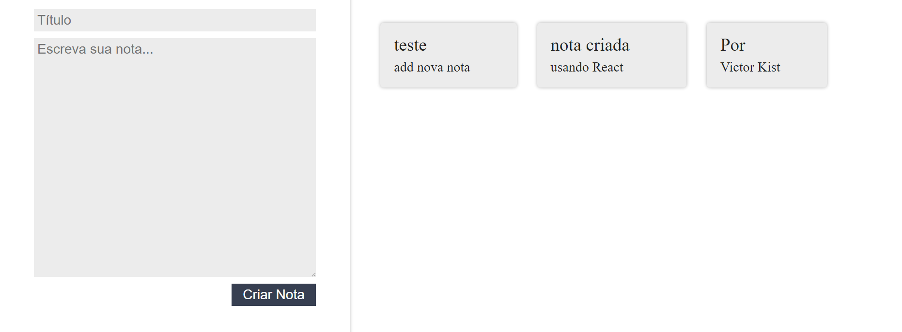
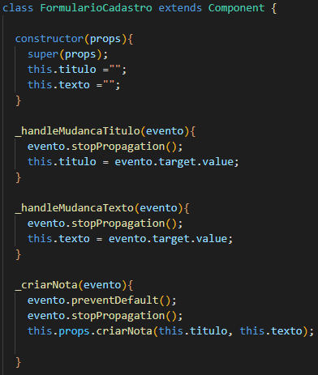
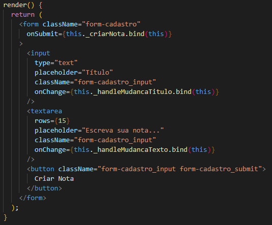
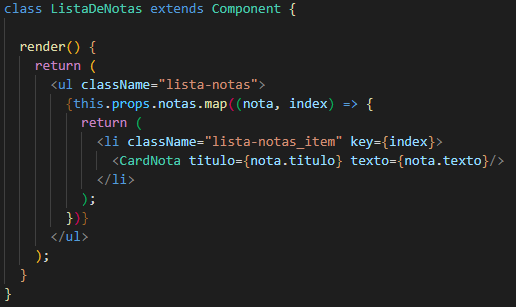
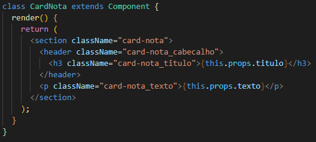

# documentação do projeto de notas ceep

## 

## 

* Métodos utilizados para "manusear" os eventos do código

* Criação da nota 

* Composição da lista de nota que aumenta conforme o usuário adiciona

* Estrutura da nota criada pelo usuário
